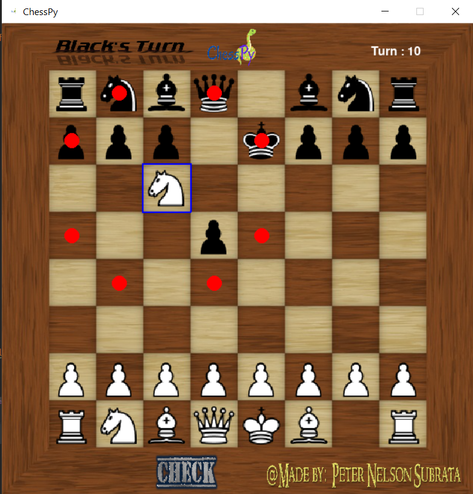

# ChessPy
A python chess program
  
Chesspy is a simple chess program fully developed in python using only pygame.  
It runs on a 626 x 626 window and for now can only support a local multiplayer setting.
  
## How to use ChessPy  
All you need to do is run the maingame code in a folder with all the other modules and sprites.  
Then the program should immediately start with a starting screen.
  

