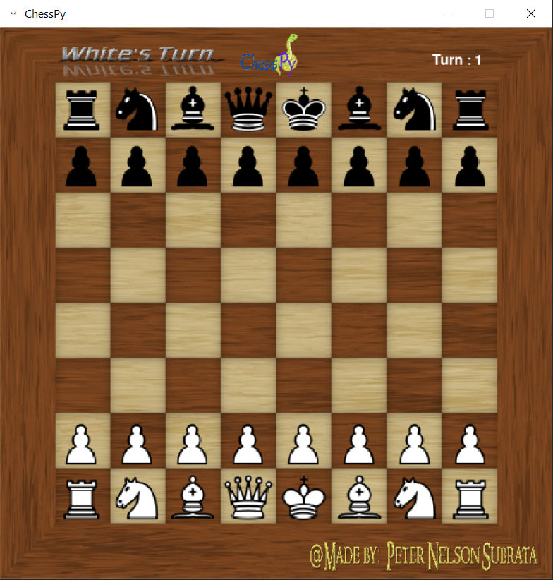

# ChessPy
A python chess program
  
Chesspy is a simple chess program fully developed in python using only pygame.  
It runs on a 626 x 626 window and for now can only support a local multiplayer setting.
  
## How to use ChessPy  
All you need to do is run the maingame code in a folder with all the other modules and sprites.  
Then the program should immediately start with a starting screen.  

ChessPyDemo Video : https://drive.google.com/file/d/1qh_MFDoJn2wJucDnZEpt1q4JvQMzdVX9/view?usp=sharing
  

  
Once youve launched the game and gone throught the starting screen, it should look like this   

  
  
Moving around in the game requires you to left click on a piece and then right click on the red dots.  
Once you do that the goal is to check mate the enemy king however way possible.  
Goodluck   

